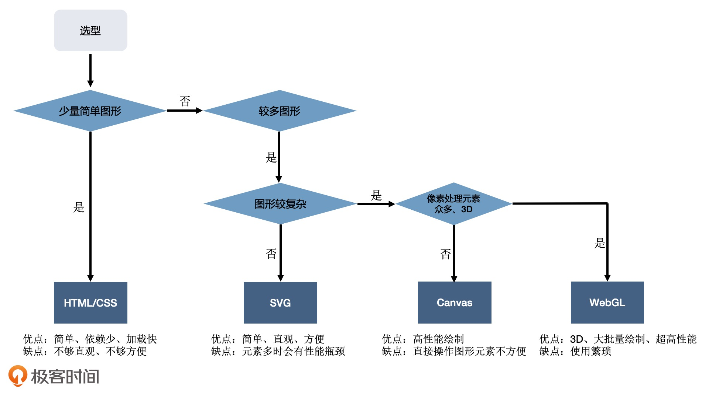

[toc]

# [浏览器中实现可视化的四种方式](https://time.geekbang.org/column/article/252076)

## HTML+CSS

这种方式通常用来呈现普通的 Web 网页。

## SVG

SVG 和传统的 HTML+CSS 的绘图方式差别不大。只不过，HTML 元素在绘制矢量图形方面的能力有些不足（我们后面会讲到），而 SVG 恰好弥补了这方面的缺陷。

## Canvas2D

浏览器提供的 Canvas API 中的其中一种上下文，使用它可以非常方便地绘制出基础的几何图形。在可视化中，Canvas 比较常用

## WebGL

浏览器提供的 Canvas API 中的另一种上下文，它是 OpenGL ES 规范在 Web 端的实现。我们可以通过它，用 GPU 渲染各种复杂的 2D 和 3D 图形。值得一提的是，WebGL 利用了 GPU 并行处理的特性，这让它在处理大量数据展现的时候，性能大大优于前 3 种绘图方式。因此，在可视化的应用中，一些数据量大、视觉效果要求高的特殊场景，使用 WebGL 渲染是一种比较合适的选择。

# 宏观层面带你了解这些图形系统

## HTML+CSS/SVG

无论是使用 HTML/CSS 还是 SVG，它们都属于**声明式绘图系统**，也就是我们根据数据创建各种不同的图形元素（或者 CSS 规则），然后利用浏览器渲染引擎解析它们并渲染出来。

## Canvas2D

Canvas2D 是浏览器提供的一种可以直接用代码在一块平面的“画布”上绘制图形的 API，使用它来绘图更像是传统的“编写代码”，简单来说就是调用绘图指令，然后引擎直接在页面上绘制图形。这是一种**指令式绘图系统**。

Canvas 元素在浏览器上创造一个空白的**画布**，通过提供渲染上下文，赋予我们绘制内容的能力。然后，我们只需要调用渲染上下文，设置各种属性，然后调用绘图指令完成输出，就能在画布上呈现各种各样的图形了。

Canvas 还提供了非常丰富的设置和绘图 **API**，我们可以通过操作上下文，来改变填充和描边颜色，对画布进行几何变换，调用各种绘图指令，然后将绘制的图形输出到画布上来实现更加复杂的效果。

Canvas 能够直接操作绘图上下文，不需要经过 HTML、CSS 解析、构建渲染树、布局等一系列操作。因此单纯绘图的话，Canvas 比 HTML/CSS 和 SVG 要快得多。

canvas2D难点: 

HTML 和 SVG 一个元素对应一个基本图形，所以我们可以很方便地操作它们，比如在柱状图的某个柱子上注册点击事件。而同样的功能在 Canvas 上就比较难实现了

对于 Canvas 来说，绘制整个柱状图的过程就是一系列指令的执行过程，其中并没有区分“A 柱子”、“B 柱子”，这让我们很难单独对 Canvas 绘图的**局部进行控制**。这并不代表我们就不能控制 Canvas 的局部, 通过数学计算我们是可以通过定位的方式来获取局部图形的

> Canvas 和 SVG 的使用也不是非此即彼的，它们可以结合使用。因为 SVG 作为一种图形格式，也可以作为 image 元素绘制到 Canvas 中。
>
> 举个例子，我们可以先使用 SVG 生成某些图形，然后用 Canvas 来渲染。这样，我们就既可以享受 SVG 的便利性，又可以享受 Canvas 的高性能了。

## WebGL

WebGL 是基于 OpenGL ES 规范的浏览器实现的，API 相对更底层，使用起来不如前三种那么简单直接

一般情况下，Canvas2D 绘制图形的性能已经足够高了，但是在三种情况下我们有必要直接操作更强大的 GPU 来实现绘图。

**要绘制的图形数量非常多** ---- 有多达数万个几何图形需要绘制，而且它们的位置和方向都在不停地变化，那我们即使用 Canvas2D 绘制了，性能还是会达到瓶颈。这个时候，我们就需要使用 GPU 能力，直接用 WebGL 来绘制。

**对较大图像的细节做像素处理** ---- 实现物体的光影、流体效果和一些复杂的像素滤镜。由于这些效果往往要精准地改变一个图像全局或局部区域的所有像素点，要计算的像素点数量非常的多（一般是数十万甚至上百万数量级的）。这时，即使采用 Canvas2D 操作，也会达到性能瓶颈

**绘制 3D 物体** ---- WebGL 内置了对 3D 物体的投影、深度检测等特性，所以用它来渲染 3D 物体就不需要我们自己对坐标做底层的处理了。那在这种情况下，WebGL 无论是在使用上还是性能上都有很大优势。

WebGL 是浏览器提供的功能强大的绘图系统，它使用比较复杂，但是功能强大，能够充分利用 GPU 并行计算的能力，来快速、精准地操作图像的像素，在同一时间完成数十万或数百万次计算。另外，它还内置了对 3D 物体的投影、深度检测等处理，这让它更适合绘制 3D 场景。

