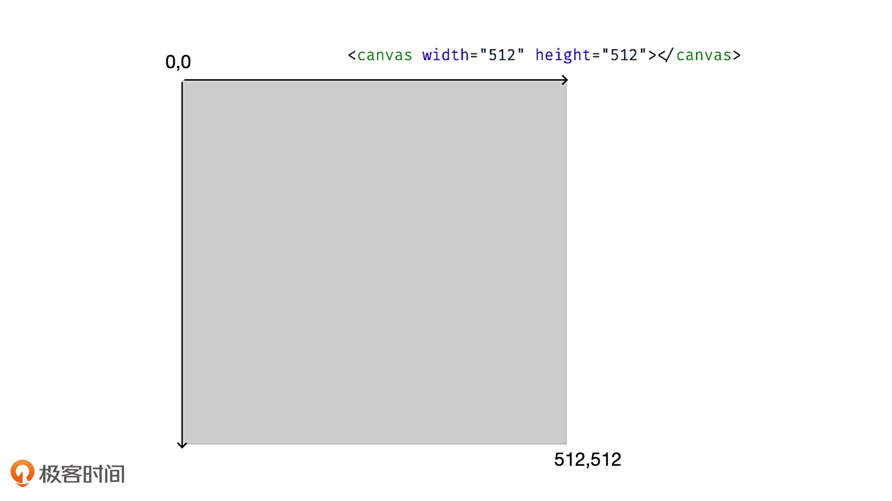

[toc]

# [指令式绘图系统：如何用Canvas绘制层次关系图？](https://time.geekbang.org/column/article/252705)

Canvas 是可视化领域里非常重要且常用的**图形系统**，在可视化项目中，它能够帮助我们将数据内容以几何图形的形式，非常方便地呈现出来。

## canvas 的尺寸

- width/height 属性 ---- 决定了 Canvas 的坐标系
- CSS 尺寸 ---- 影响 Canvas 在页面上呈现的大小, 不设置 Canvas 元素的样式, 则会等同于其属性值

Canvas 元素上的 width 和 height 属性不等同于 Canvas 元素的 CSS 样式的属性。

为了区分它们，我们称 Canvas 的 HTML 属性宽高为画布宽高，CSS 样式宽高为样式宽高。

因为画布宽高决定了可视区域的坐标范围，所以 Canvas 将画布宽高和样式宽高分开的做法，能更方便地适配不同的显示设备。

## canvas 的坐标系

Canvas 的坐标系和浏览器窗口的坐标系类似，它们都默认左上角为坐标原点，x 轴水平向右，y 轴垂直向下。



在我们设置好的画布宽高为 512*512 的 Canvas 画布中，它的左上角坐标值为（0,0），右下角坐标值为（512,512） 。这意味着，坐标（0,0）到（512,512）之间的所有图形，都会被浏览器渲染到画布上。

## 利用 Canvas 绘制几何图形

具体的步骤可以分为两步，分别是获取 Canvas 上下文和利用 Canvas 上下文绘制图形:

- 获取 Canvas 上下文

  获取 Canvas 上下文也需要两个步骤。获取 Canvas 元素并通过 getContext 方法拿到它的上下文对象。

  ```js
  const canvas = document.querySelector('canvas');
  const context = canvas.getContext('2d');
  ```

- 用 Canvas 上下文绘制图形

  context 对象上会有许多 API，它们大体上可以分为两类：

  一类是设置状态的 API，可以设置或改变当前的绘图状态，如改变要绘制图形的颜色、线宽、坐标变换等等；

  另一类是绘制指令 API，用来绘制不同形状的几何图形。


## Canvas 的优缺点

Canvas 是一个非常简单易用的图形系统。Canvas 通过一组简单的绘图指令，就能够方便快捷地绘制出各种复杂的几何图形。

Canvas 渲染起来相当高效。绘制大量轮廓非常复杂的几何图形，Canvas 也只需要调用一组简单的绘图指令就能高性能地完成渲染。

缺点: 因为 Canvas 在 HTML 层面上是一个独立的画布元素，所以所有的绘制内容都是在内部通过绘图指令来完成的，绘制出的图形对于浏览器来说，只是 Canvas 中的一个个像素点，我们很难直接抽取其中的图形对象进行操作。
