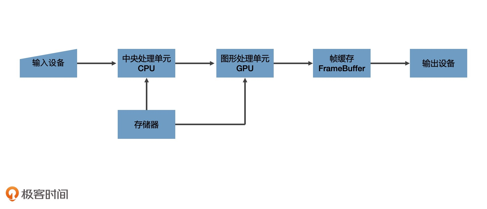
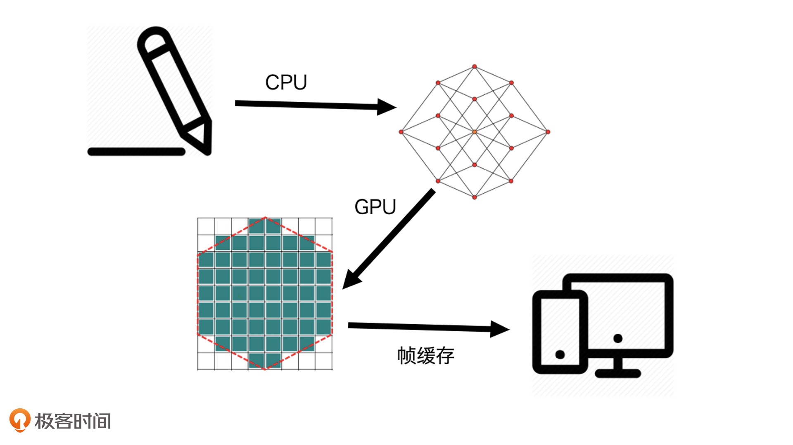
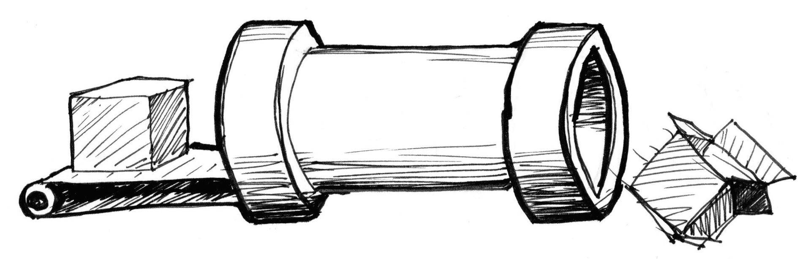
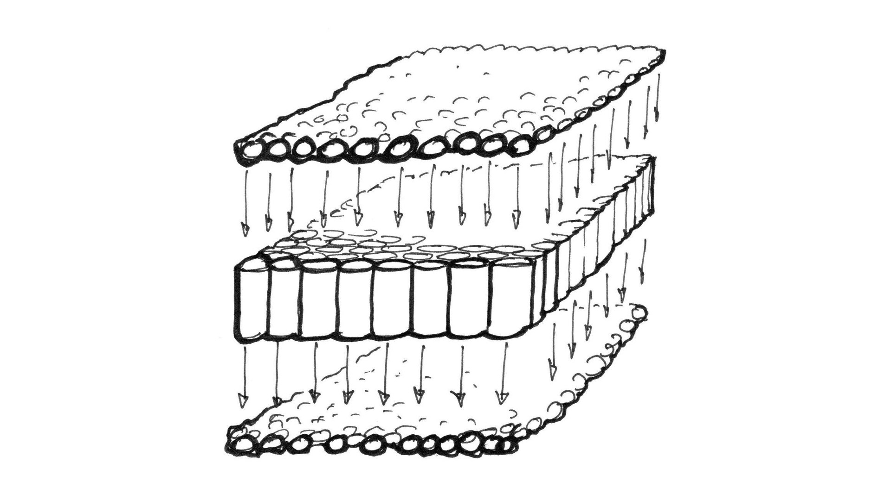
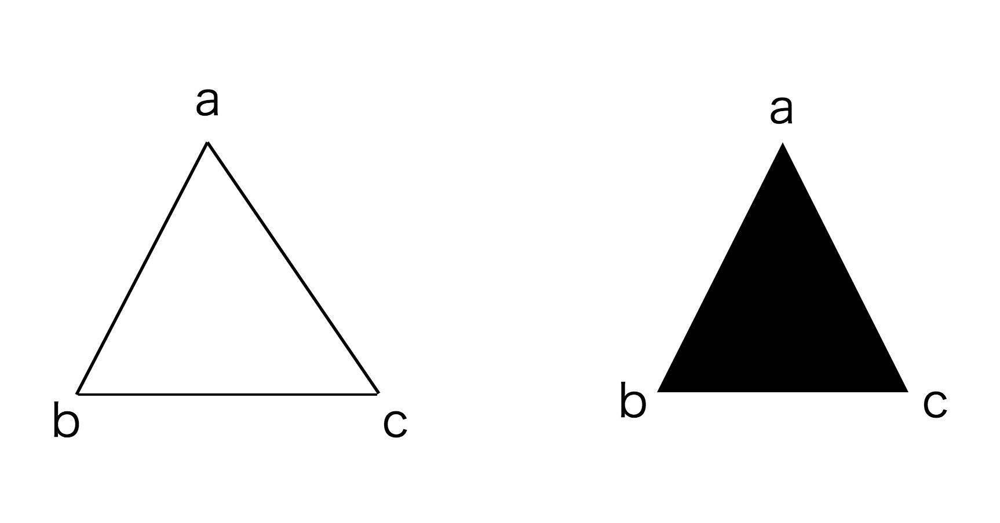
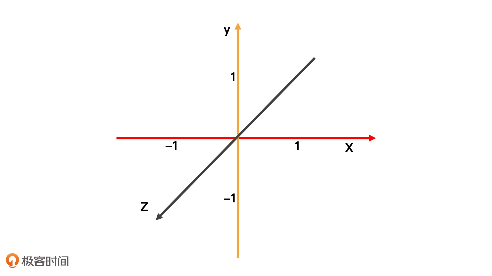
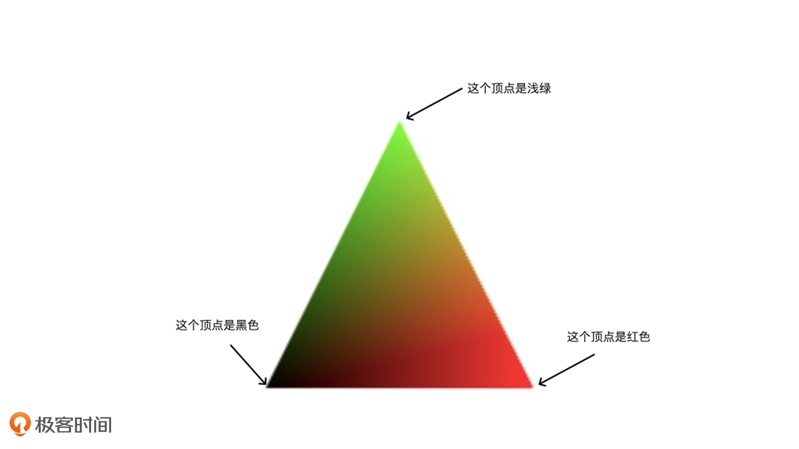
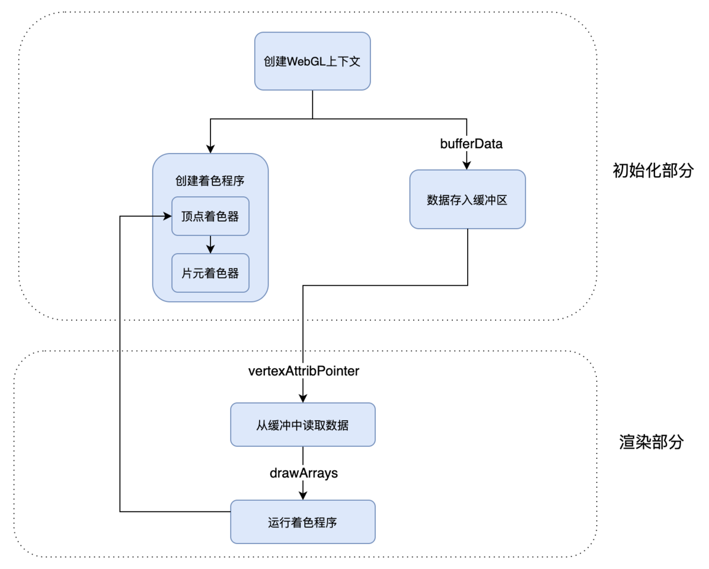

[TOC]

# [GPU与渲染管线：如何用WebGL绘制最简单的几何图形？](https://time.geekbang.org/column/article/254631)


WebGL 这种技术本身就是用来解决最复杂的视觉呈现的。比如说，大批量绘制复杂图形和 3D 模型，这类比较有难度的问题就适合用 WebGL 来解决。

WebGL 相对于其他图形系统来说，是一个更“开放”的系统。“开放”是针对于底层机制而言的, 要使用 WebGL 绘图，我们必须要深入细节里。换句话说就是，我们必须要和内存、GPU 打交道，真正控制图形输出的每一个细节。

学好 WebGL，我们必须先理解一些基本概念和原理。那今天这一节课，我会从图形系统的绘图原理开始讲起，主要来讲 WebGL 最基础的概念，包括 GPU、渲染管线、着色器。

## 图形系统是如何绘图的？

计算机图形系统的主要组成部分，以及它们在绘图过程中的作用。知道了这些，我们就能很容易理解计算机图形系统绘图的基本原理了。

一个通用计算机图形系统主要包括 6 个部分，分别是

- 输入设备、
- 中央处理单元、
- 图形处理单元、
- 存储器、
- 帧缓存
- 输出设备。

虽然我下面给出了绘图过程的示意图，不过这些设备在可视化中的作用，我要再跟你多啰嗦几句。



- 光栅（Raster）：几乎所有的现代图形系统都是基于光栅来绘制图形的，光栅就是指构成图像的像素阵列。
- 像素（Pixel）：一个像素对应图像上的一个点，它通常保存图像上的某个具体位置的颜色等信息。
- 帧缓存（Frame Buffer）：在绘图过程中，像素信息被存放于帧缓存中，帧缓存是一块内存地址。
- CPU（Central Processing Unit）：中央处理单元，负责逻辑计算。
- GPU（Graphics Processing Unit）：图形处理单元，负责图形计算。

## 典型的绘图过程

首先，**数据**经过 **CPU** 处理，成为**具有特定结构的几何信息**。

然后，这些几何信息会被送到 **GPU** 中进行处理。

在 GPU 中要经过两个步骤生成**光栅信息**。

这些光栅信息会输出到**帧缓存**中，最后**渲染**到屏幕上。



这个绘图过程是现代计算机中任意一种图形系统处理图形的通用过程。

它主要做了两件事，

一是对给定的数据结合绘图的场景要素（例如相机、光源、遮挡物体等等）进行计算，最终将图形变为屏幕空间的 2D 坐标。

二是为屏幕空间的每个像素点进行着色，把最终完成的图形输出到显示设备上。

整个过程是一步一步进行的，前一步的输出就是后一步的输入，所以我们也把这个过程叫做**渲染管线（RenderPipelines）** 在这个过程中，CPU 与 GPU 是最核心的两个处理单元，它们参与了计算的过程。

## GPU

CPU 和 GPU 都属于处理单元，但是结构不同。形象点来说，CPU 就像个大的工业管道，等待处理的任务就像是依次通过这个管道的货物。一条 CPU 流水线串行处理这些任务的速度，取决于 CPU（管道）的处理能力。

一个计算机系统会有很多条 CPU 流水线，而且任何一个任务都可以随机地通过任意一个流水线，这样计算机就能够并行处理多个任务了。这样的一条流水线就是我们常说的**线程**（Thread）。

> CPU 的重要指标: N 核 M 线程



这样的结构用来处理大型任务是足够的，但是要处理图像应用就不太合适了。这是因为，处理图像应用，实际上就是在处理计算**图片**上的每一个**像素点的颜色和其他信息**。每处理一个像素点就相当于完成了一个简单的任务，而一个图片应用又是由成千上万个像素点组成的，所以，我们需要在同一时间处理成千上万个小任务。

要处理这么多的小任务，比起使用若干个强大的 CPU，使用更小、更多的处理单元，是一种更好的处理方式。而 GPU 就是这样的处理单元。



GPU 是由大量的小型处理单元构成的，它可能远远没有 CPU 那么强大，但胜在数量众多，可以保证每个单元处理一个简单的任务。即使我们要处理一张 800 * 600 大小的图片，GPU 也可以保证这 48 万个像素点分别对应一个小单元，这样我们就可以同时对每个像素点进行计算了。


## WebGL 绘制三角形

浏览器提供的 WebGL API 是 **OpenGL ES** 的 JavaScript 绑定版本，它赋予了开发者**操作 GPU 的能力**。

这一特点也让 WebGL 的绘图方式和其他图形系统的“开箱即用”（直接调用绘图指令或者创建图形元素就可以完成绘图）的绘图方式完全不同，甚至要复杂得多。我们可以总结为以下 5 个步骤：

1. 创建 WebGL 上下文
2. 创建 WebGL 程序（WebGL Program）
3. 将数据**<u>存入</u>缓冲区**
4. **将缓冲区数据<u>读取</u>到 GPU**
5. GPU 执行 WebGL 程序，输出结果

完整绘制示例代码如下:

```js
/* 创建 WebGL 上下文 */
const canvas = document.querySelector('canvas');
const gl = canvas.getContext('webgl'); // 获取webgl上下文
```

```js
/* 创建 WebGL 程序 */
const vertex /* 顶点 */ = `
    attribute vec2 position;
    
    void main() {
        gl_PointSize = 1.0;
        gl_Position = vec4(position, 1.0, 1.0);
    }
` 
const fragment /* 图元/图片 */ = `
    precision mediump float;

    void main() {
        gl_FragColor = vec4(1.0, 0.0, 0.0, 1.0); // 定义像素点的颜色rgba
    }
`

// 创建 shader 对象 (创建着色器的目的是为了创建 WebGL 程序)
const vertexShader = gl.createShader(gl.VERTEX_SHADER);
gl.shaderSource(vertexShader, vertex);
gl.compileShader(vertexShader);

const fragmentShader = gl.createShader(gl.FRAGMENT_SHADER);
gl.shaderSource(fragmentShader, fragment);
gl.compileShader(fragmentShader);

// 创建 WebGLProgram 对象, 关联 shader
const webglProgram = gl.createProgram();
gl.attachShader(webglProgram, vertexShader);
gl.attachShader(webglProgram, fragmentShader);
gl.linkProgram(webglProgram);

// 通过 useProgram 选择启用这个 WebGLProgram 对象
gl.useProgram(webglProgram);
```

```js
/* 将数据存入缓冲区 */
// 定义三角形的三个顶点
const points = new Float32Array([ -1, -1, 0, 1, 1, -1,]);

// 将定义好的数据写入 WebGL 的缓冲区
const bufferId = gl.createBuffer();
gl.bindBuffer(gl.ARRAY_BUFFER, bufferId);
gl.bufferData(gl.ARRAY_BUFFER, points, gl.STATIC_DRAW);
```

```js
/* 将缓冲区数据读取到 GPU */
const vPosition = gl.getAttribLocation(webglProgram, 'position'); //获取顶点着色器中的position变量的地址
gl.vertexAttribPointer(vPosition, 2, gl.FLOAT, false, 0, 0); //给变量设置长度和类型
gl.enableVertexAttribArray(vPosition); // 激活变量
```

```js
/* 执行着色器程序完成绘制 */
gl.clear(gl.COLOR_BUFFER_BIT);
gl.drawArrays(gl.TRIANGLES, 0, points.length / 2);
```

### 创建 WebGL 程序

首先，要创建这个 WebGL 程序，我们需要编写两个**着色器**（Shader）。着色器是用 GLSL 这种编程语言编写的代码片段。（创建着色器的目的是为了创建 WebGL 程序）

**顶点和图元** ---- 在绘图的时候，WebGL 是以顶点和图元来描述图形几何信息的。**顶点**就是几何图形的顶点，比如，三角形有三个顶点，四边形有四个顶点。**图元**是 **WebGL 可直接处理的图形单元**，由 WebGL 的绘图模式决定，有点、线、三角形等等(一共有七种)。顶点和图元是绘图过程中必不可少的。

WebGL 绘制一个图形的过程，一般需要用到两段着色器，一段叫**顶点着色器（Vertex Shader）**负责处理图形的**顶点**信息，另一段叫**片元着色器（Fragment Shader）**负责处理图形的**像素**信息。

具体点来说，我们可以**把顶点着色器理解为处理顶点的 GPU 程序代码。它可以改变顶点的信息**（如顶点的坐标、法线方向、材质等等），从而改变我们绘制出来的图形的形状或者大小等等。

#### ---- 片元着色器的作用和使用特点:

顶点处理完成之后，WebGL 就会根据顶点和绘图模式指定的图元，计算出需要着色的像素点，然后**对它们(图元)执行片元着色器程序**。简单来说，就是**对指定图元中的像素点着色**。

WebGL **从顶点着色器和图元提取像素点给片元着色器执行代码**的过程，就是我们前面说的**生成光栅(Guāngzhà)信息**的过程，我们也叫它光栅化过程。所以，**片元着色器的作用，就是处理光栅化后的像素信息**。这个过程是**并行**的。也就是说，无论有多少个像素点，片元着色器都可以同时处理。这也是片元着色器一大特点。

这么说可能比较抽象，来举个例子。我们可以<u>将图元设为线段</u>，那么片元着色器就会处理顶点之间的<u>线段上的像素点信息</u>，这样画出来的图形就是空心的。而如果我们<u>把图元设为三角形</u>，那么片元着色器就会处理<u>三角形内部的所有像素点</u>，这样画出来的图形就是实心的。



创建 **WebGLProgram 对象**，并将这两个 **shader 关联**到这个 WebGL 程序上。WebGLProgram 对象的创建过程主要是添加 vertexShader 和 fragmentShader，然后将这个 WebGLProgram 对象**链接**到 WebGL 上下文对象上。

最后，我们要通过 useProgram 选择**启用**这个 WebGLProgram 对象。这样，当我们绘制图形时，GPU 就会执行我们通过 WebGLProgram 设定的 两个 shader 程序了。

```js
createProgram() => attachShader() * 2 => linkProgram() => useProgram()
```

### 将数据存入缓冲区

WebGL 的坐标系是一个**三维空间坐标系**，坐标原点是（0,0,0）。

其中，x 轴朝右，y 轴朝上，**z 轴朝外**。这是一个右手坐标系。



**定义这个三角形的三个顶点**。WebGL 使用的数据需要用类型数组定义，默认格式是 Float32Array。Float32Array 是 JavaScript 的一种类型化数组（TypedArray），JavaScript 通常用类型化数组来处理二进制缓冲区。

**将定义好的数据写入 WebGL 的缓冲区**。这个过程我们可以简单总结为三步，分别是创建一个缓存对象，将它绑定为当前操作对象，再把当前的数据写入缓存对象。这三个步骤主要是利用 createBuffer、bindBuffer、bufferData 方法来实现的，


### 将缓冲区数据读取到 GPU

已经把数据写入缓存了，但是我们的 shader 现在还不能读取这个数据，

还需要把数据绑定给<u>顶点着色器</u>中的 position <u>变量</u>。

**webgl实际上是JS与GPU进行交互**，所以要先将JS的数据**存入缓存**，在webgl程序运行的时候底层**从缓存中读取数据给shader**，在shader中完成图形绘制。所以**是一读一写**的过程

```js
// 顶点着色器
attribute vec2 position;

void main() {
  gl_PointSize = 1.0;
  gl_Position = vec4(position, 1.0, 1.0);
}
```

在 GLSL 中，attribute 表示声明变量，vec2 是变量的类型，它表示一个二维向量，position 是变量名。

将 buffer 的数据绑定给顶点着色器的 position 变量。

```js
// 获取顶点着色器中的position变量的地址
const vPosition = gl.getAttribLocation(program, 'position'); 
// 给变量设置长度和类型
gl.vertexAttribPointer(vPosition, 2, gl.FLOAT, false, 0, 0);
// 激活这个变量
gl.enableVertexAttribArray(vPosition);
```

经过这样的处理，在顶点着色器中，我们定义的 points 类型数组中对应的值，就能通过变量 position 读到了


### 执行着色器程序完成绘制

把数据传入缓冲区以后，GPU 也可以读取绑定的数据到着色器变量了。

接下来，我们只需要调用绘图指令，就可以执行着色器程序来完成绘制了。

先调用 gl.clear 将当前画布的内容清除，然后调用 gl.drawArrays 传入绘制模式。

选择 gl.TRIANGLES 表示以三角形为图元绘制，再传入绘制的顶点偏移量和顶点数量，WebGL 就会将对应的 buffer 数组传给顶点着色器，并且开始绘制。

```js
gl.clear(gl.COLOR_BUFFER_BIT);
gl.drawArrays(gl.TRIANGLES, 0, points.length / 2); // /2 是因为点是二维向量
```

这样，我们就在 Canvas 画布上画出了一个红色三角形。红色三角形是因为我们在片元着色器中定义了像素点的颜色 `gl_FragColor = vec4(1.0, 0.0, 0.0, 1.0);`

在片元着色器里，我们可以通过设置 gl_FragColor 的值来定义和改变图形的颜色。gl_FragColor 是 WebGL 片元着色器的内置变量，表示当前像素点颜色，它是一个用 RGBA 色值表示的四维向量数据。

WebGL 可以**并行**地对整个三角形的**所有像素点同时运行片元着色器**。并行处理是 WebGL 程序非常重要的概念。 不论这个三角形是大还是小，有几十个像素点还是上百万个像素点，GPU 都是同时处理每个像素点的。也就是说，图形中有多少个像素点，着色器程序在 GPU 中就会被同时执行多少次。


gl.TRANGLES ==== webgl支持的图元类型有七种，分别是 gl.POINTS(点), gl.LINES(线段), gl.LINE_STRIP(线条), gl.LINE_LOOP(回路), gl.TRIANGLES(三角形), gl.TRIANGLE_STRIP(三角带), gl.TRIANGLE_FAN(三角扇)。

webgl中最小的图元是: 点、线段和三角形


#### ---- 顶点着色器的作用

##### 通过 gl_Position 设置顶点

顶点着色器大体上可以总结为两个作用：

​	一是通过 gl_Position 设置顶点，

​	二是通过定义 varying 变量，向片元着色器传递数据。

通过 gl_Position 设置顶点假如，我想把三角形的周长缩小为原始大小的一半，有两种处理方式法：

​	一种是修改 points 数组的值，这种做法很简单

​	另一种做法是直接对顶点着色器数据进行处理， 如理如下

我们不需要修改 points 数据，只需要在顶点着色器中，将 `gl_Position = vec4(position, 1.0, 1.0);` 修改为 `gl_Position = vec4(position * 0.5, 1.0, 1.0);`,  具体理解为, 二维坐标全都取原来的一半

在这个过程中，我们不需要遍历三角形的每一个顶点，只需要是利用 GPU 的并行特性，在顶点着色器中同时计算所有的顶点就可以了。

##### 向片元着色器传递数据

除了计算顶点之外，顶点着色器还可以**将数据通过 varying 变量传给片元着色器**。然后，这些值会根据片元着色器的像素坐标与顶点像素坐标的相对位置做**线性插值**。

```js
/* 顶点着色器 */
attribute vec2 position;
varying vec3 color; // 定义varying变量, 传给片元着色器

void main() {
  gl_PointSize = 1.0;
  color = vec3(0.5 + position * 0.5, 0.0);
  gl_Position = vec4(position * 0.5, 1.0, 1.0);
}
```

定义了一个 color 变量，它是一个三维的向量。

通过数学技巧将顶点的值映射为一个 RGB 颜色值, 映射公式是 vec3(0.5 + position * 0.5, 0.0)。

这样一来，顶点[-1,-1]被映射为[0,0,0]也就是黑色，顶点[0,1]被映射为[0.5, 1, 0]也就是浅绿色，顶点[1,-1]被映射为[1,0,0]也就是红色。这样一来，三个顶点就会有三个不同的颜色值。

然后我们将 color 通过 varying 变量传给片元着色器。片元着色器中的代码如下：

```js
/* 片元着色器 */
precision mediump float;
varying vec3 color; // 读取varying变量

void main()
{
  gl_FragColor = vec4(color, 1.0);
}  
```

将 gl_FragColor 的 rgb 值设为变量 color 的值，这样我们就能得到一个颜色均匀（线性）渐变的三角形：



中间像素点的颜色是均匀过渡的。这就是因为 WebGL 在执行片元着色器程序的时候，顶点着色器传给片元着色器的变量，会根据片元着色器的像素坐标对变量进行线性插值。利用线性插值可以让像素点的颜色均匀渐变这一特点，我们就能绘制出颜色更丰富的图形了


## 要点总结

WebGL 图形系统与用其他图形系统不同，它的 API 非常底层，使用起来比较复杂。

在 WebGL 中要完成图形的绘制，需要<u>创建 WebGL 程序</u>，然后<u>将图形的几何数据存入数据缓冲区</u>，在绘制过程中让 WebGL <u>从缓冲区读取数据</u>，并且<u>执行着色器程序</u>。

WebGL 的着色器程序有两个。一个是顶点着色器，负责处理图形的顶点数据。另一个是片元着色器，负责处理光栅化后的像素信息。

WebGL 程序有一个非常重要的特点就是能够并行处理，无论图形中有多少个像素点，都可以通过着色器程序在 GPU 中被同时执行。

WebGL 完整的绘图过程实在比较复杂, 绘图流程图如下:


