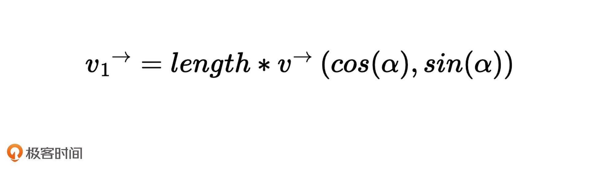

[TOC]

# [如何用向量和坐标系描述点和线段？](https://time.geekbang.org/column/article/255584)

在可视化项目里，我们需要描述很多的图形，而描述图形的顶点、边、线、面、体和其他各种信息有很多不同的方法。并且，如果我们使用不同的绘图系统，每个绘图系统又可能有独特的方式或者特定的 API，去解决某个或某类具体的问题。

正因为有了太多可以选择的工具，我们也就很难找到最恰当的那一个。

**而且如果我们手中只有解决具体问题的工具，没有统一的方法论，那我们也无法一劳永逸地解决问题的根本。**

要建立一套与各个图形系统无关联的、简单的基于向量和矩阵运算的数学体系，用它来描述所有的几何图形信息。

**如何建立一套描述几何图形信息的数学体系，以及如何用这个体系来解决我们的可视化图形呈现的问题。**

本篇用**坐标系与向量来描述基本图形**的方法，从如何定义**和变换图形的直角坐标系**，以及如何运**用向量表示点和线段**这两方面讲起。


## 坐标系与坐标映射

浏览器的四个图形系统通用的坐标系: 

1. HTML 采用的是窗口坐标系，以参考对象（参考对象通常是最接近图形元素的 position 非 static 的元素）的**元素盒子左上角为坐标原点**，**x 轴向右，y 轴向下**，坐标值对应像素值。

2. SVG 采用的是视区盒子（viewBox）坐标系。这个坐标系在默认情况下，是以 **svg 根元素左上角为坐标原点**，**x 轴向右，y 轴向下**，svg 根元素右下角坐标为它的像素宽高值。

   如果我们设置了 viewBox 属性，那么 svg 根元素左上角为 viewBox 的前两个值，右下角为 viewBox 的后两个值。

3. Canvas 采用的坐标系默认以**画布左上角为坐标原点**，右下角坐标值为 Canvas 的画布宽高值。

4. WebGL 的坐标系比较特殊，是一个三维坐标系。

   它默认**以画布正中间为坐标原点，x 轴朝右，y 轴朝上，z 轴朝外**，x 轴、y 轴**在画布中范围是 -1 到 1**。

尽管这四个坐标系在原点位置、坐标轴方向、坐标范围上有所区别，但都是直角坐标系，所以它们都满足**直角坐标系的特性**：不管原点和轴的方向怎么变，用同样的方法绘制几何图形，它们的形状和相对位置都不变。


## 坐标转换

为了方便处理图形，我们经常需要对坐标系进行转换。转换坐标系可以说是一个非常基础且重要的操作。

正因为这四个坐标系都是直角坐标系，所以它们可以很方便地相互转化。其中，HTML、SVG 和 Canvas 都提供了 transform 的 API 能够帮助我们很方便地转换坐标系。

WebGL 本身不提供 tranform 的 API，但我们可以在 shader 里做矩阵运算来实现坐标转换。

以 Canvas 为例，来看看用 transform API 怎样进行坐标转换。

### 如何用 Canvas 实现坐标系转换？

~ 看demo

在可视化的许多应用场景中，我们都要处理成百上千的图形。如果这个时候，我们在原始坐标下通过计算顶点来绘制图形，计算量会非常大，很麻烦。那采用坐标变换的方式就是一个很好的优化思路，它能够简化计算量，这不仅让代码更容易理解，也可以节省 CPU 运算的时间。

理解直角坐标系的坐标变换之后，我们再来说说直角坐标系里绘制图形的方法。**那不管我们用什么绘图系统绘制图形，一般的几何图形都是由点、线段和面构成。其中，点和线段是基础的图元信息，因此，如何描述它们是绘图的关键。**

### 如何用向量来描述点和线段？

那在直角坐标系下，一般是**用向量来表示一个点或者一个线段**。

现在这个平面直角坐标系上有一个向量 v。向量 v 有两个含义：

​	一是可以表示该坐标系下位于 (x, y) 处的一个点；

​	二是可以表示从原点 (0,0) 到坐标 (x,y) 的一根线段。

**向量和标量一样可以进行数学运算** 

**一个向量包含有长度和方向信息** 

长度可以用向量的 x、y 的平方和的平方根:

`v.length = function(){return Math.hypot(this.x, this.y)};`

方向可以用与 x 轴的夹角来表示

`v.dir = function() { return Math.atan2(this.y, this.x);}`

Math.atan2 的取值范围是 -π到π，负数表示在 x 轴下方，正数表示在 x 轴上方。

根据长度和方向的定义，我们还能推导出一组关系式:

```js
v.x = v.length * Math.cos(v.dir);
v.y = v.length * Math.sin(v.dir);
```

推论意味着一个重要的事实：我们可以很简单地构造出一个绘图向量。也就是说，如果我们希望以点 (x0, y0) 为起点，沿着某个方向画一段长度为 length 的线段，我们只需要构造出如下的一个向量就可以了。



这里的α是与 x 轴的夹角，v 是一个单位向量，它的长度为 1 (不知道是不是不乘以这个单位向量的话得到的结果是一个标量而不是向量)。

然后我们把向量 (x0, y0) 与这个向量 v1相加，得到的就是这条线段的终点。


### 用向量绘制一棵树

~ demo 没完成

## 向量运算的意义

实际上，在我们的可视化项目里，直接使用向量的加法、旋转和乘法来构造线段绘制图形的情形并不多。这是因为，在一般情况下，**数据在传给前端的时候就已经计算好了**，我们只需要拿到数据点的信息，**根据坐标变换进行映射**，然后直接用映射后的点来绘制图形即可。

既然这样，为什么我们在这里又要强调向量操作的重要性呢？虽然我们很少直接使用向量构造线段来完成绘图，但是向量运算的意义并不仅仅只是用来算点的位置和构造线段，这只是最初级的用法。我们要记住，**可视化呈现依赖于计算机图形学，而向量运算是整个计算机图形学的数学基础**。


## 小试牛刀

### 两个向量的关系计算

线段 A1B1 与线段 A2B2 的关系 {
 如果 |A1B1| 或 |A2B2| 为 0 ，说明线段退化成点，无法判断关系
 如果 A1B1·A2B2 为 0，说明夹角的余弦值为 0，二者垂直
 如果 |A1B1×A2B2| 为 0，说明夹角的正弦值为 0，二者方向一致，可能平行也可能重合 {
  如果 |A1B1×A1A2| 不为0，说明四点不共线，排除掉重合的情况，二者平行
 }
 其他情况即为既不平行也不垂直
}


点 P 到线段 AB 的距离 {
 如果 |AB| 为 0，说明线段退化成点，|AP| 就是距离
 如果 AP·AB：
  <0，说明 P 到 AB 的投影在线段 BA 的延长线上，∠PAB 为钝角，|AP| 就是距离
  \>|AB|，说明 P 到 AB 的投影在线段 AB 的延长线上，∠PBA 为钝角，|BP| 就是距离
  其他情况，说明 P 到 AB 的投影在线段 AB 上，用 |AP×AB| 除以 |AB| 即可算出距离（外积模的几何意义 |absinθ| 就是平行四边形的面积，除以底得到高）
}