[TOC]

# [可视化中你必须要掌握的向量乘法知识](https://time.geekbang.org/column/article/256827)


## 向量的点乘

两个 N 维向量 a 和 b，a = [a1, a2, ...an]，b = [b1, b2, ...bn]，那向量的点积代码如下：

```js
a•b = a1*b1 + a2*b2 + ... + an*bn
```

在 N 维线性空间中，a、b 向量点积的几何含义，是 **a 向量乘以 b 向量在 a 向量上的投影分量**。

它的物理含义相当于 a 力作用于物体，产生 b 位移所做的功。

**点乘最后得出的结果是一个标量**, 点乘公式如下图:

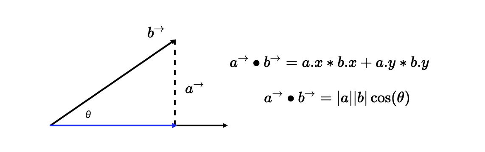

两个比较特殊的情况:

第一种是，当 a、b 两个向量**平行**时，它们的夹角就是 0°，那么 a·b=|a|*|b|

第二种是，当 a、b 两个向量垂直时，它们的夹角就是 90°，那么 a·b=0

点乘应用:

1. <u>计算长度和角度</u>
2. <u>检测正交性</u> ---- 当角度为90度时，即点积为0时，两个向量正交。


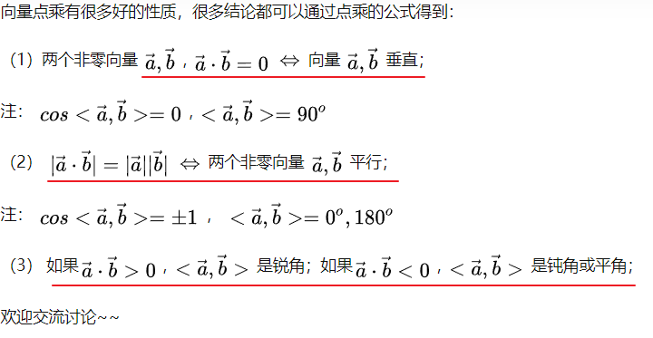


## 向量的叉乘

叉乘和点乘有两点不同：

首先，**向量叉乘运算的结果是一个向量**，而不是标量；

其次，**两个向量的叉积与两个向量组成的坐标平面垂直**。 (法向量 ---- 法向量，是[空间](https://baike.baidu.com/item/空间/55280)解析几何的一个[概念](https://baike.baidu.com/item/概念/829047)，垂直于平面的直线所表示的向量为该平面的法向量。)

以二维空间为例，向量 a 和 b 的叉积，就相当于向量 a（蓝色带箭头线段）与向量 b 沿垂直方向的投影（红色带箭头线段）的乘积。那如下图所示，二维向量叉积的几何意义就是**向量 a、b 组成的平行四边形的面积**。

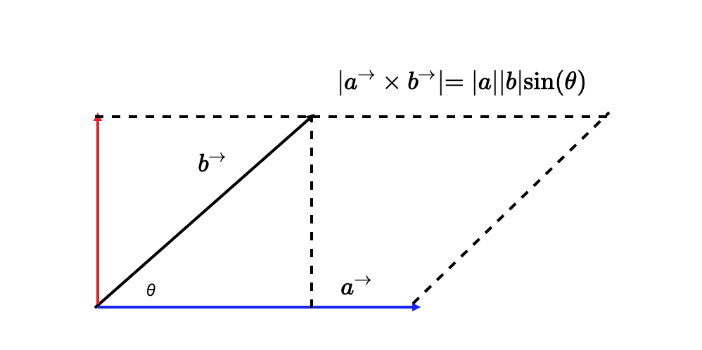


那叉乘在数学上该怎么计算呢？假设，现在有两个三维向量 a(x1, y1, z1) 和 b(x2, y2, z2)，那么，a 与 b 的叉积可以表示为一个如下图的行列式：

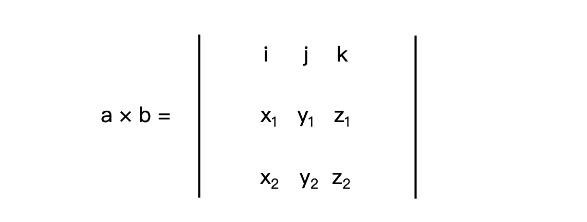

其中 i、j、k 分别是 x、y、z 轴的单位向量。

把这个行列式展开，就能得到如下公式：

```js
a X b = [y1 * z2 - y2 * z1, - (x1 * z2 - x2 * z1), x1 * y2 - x2 * y1]
```

(右下方向的乘积 - 左上方向的乘积)

计算这个公式，得到的值还是一个三维向量，它的方向垂直于 a、b 所在平面。因此，我们刚才说的二维空间中，向量 a、b 的叉积方向就是垂直纸面朝向我们的。用叉积得到的向量垂直于a、b 所在平面, 但是会有两个方向, 需要判断方向

<u>有什么办法可以很容易，就确定出 a、b 的叉积方向呢？</u>

左手系和右手系，其中 x 轴向右、y 轴向下的坐标系是右手系。

在右手系中求向量 a、b 叉积的方向时，我们可以把<u>右手食指的方向朝向 a，把右手中指的方向朝向 b</u>，那么**大拇指所指的方向就是 a、b 叉积的方向**，这个方向是垂直纸面向外（即朝向我们）。因此，右手系中向量叉乘的方向就是右手拇指的方向

那左手系中向量叉乘的方向自然就是左手拇指的方向了。

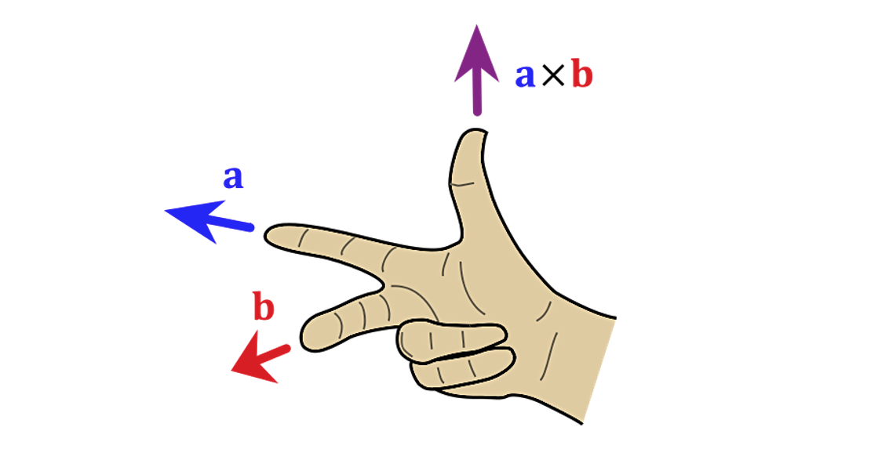

在二维空间里，由于 z 的值为 0，因此我们得到的向量 a X b 的数值，就等于 x1 * y2 - x2 * y1。

在了解了向量叉积的几何意义之后, 通过<u>向量叉积得到平行四边形面积，再除以底边长</u>，就能得到<u>点到向量所在直线的距离</u>了

## 归一化

归一化就是**让向量 v除以它的长度（或者说是模）。归一化后的向量方向不变，长度为 1。**

归一化是向量运算中一个非常重要的操作，用处也非常多。

在向量乘法里，如果 a、b 都是长度为 1 的归一化向量，那么|a X b| 的结果就是 a、b 夹角的正弦值，而|a • b|的结果就是 a、b 夹角的余弦值。 把向量归一化以后，我们就可以通过向量的点乘与叉乘快速求出向量夹角的正弦和余弦值。

这个**特性在图形学里用处非常大**，你一定要记住它。


对于图形学来说，向量运算是基础中的基础，非常重要。所以，我们不仅要熟练掌握，还要学会用向量的思路去解决问题


## 补充 [zhihu](https://www.zhihu.com/question/21080171)

向量：既有方向又有大小的量

通常情况下会将向量放到坐标系中，常用的是笛卡尔坐标系，向量起始点通常放到原点（**注：没有固定的起点，[只要方向相同，大小相等]，就认为两向量是相同的，但为了用数值坐标来表示向量，将起始点放到原点**）

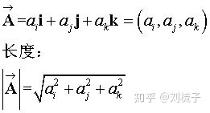

点积（对应元素相乘相加, 结果是一个数）


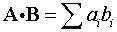

几何意义：投影


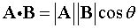

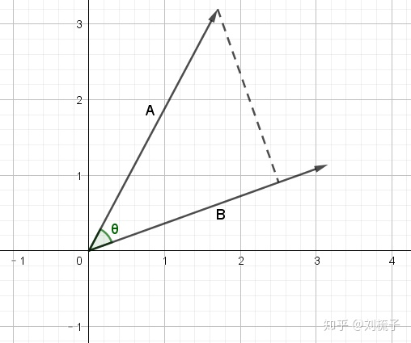

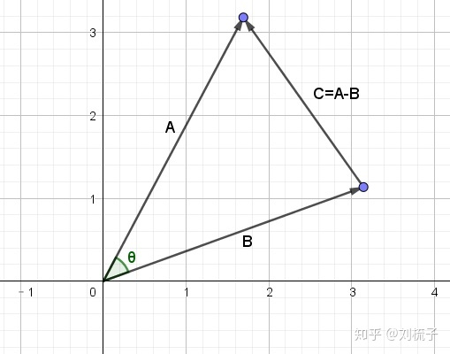

为什么数值计算的结果就代表几何上的投影呢？利用余弦定理：

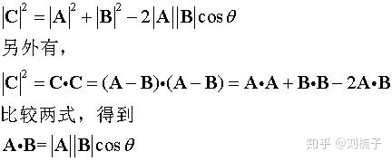

叉积

定义：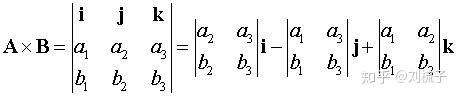

意义：**叉乘结果是一个向量，向量模长是向量A，B组成平行四边形的面积；向量方向是垂直于向量A,B组成的平面；**
