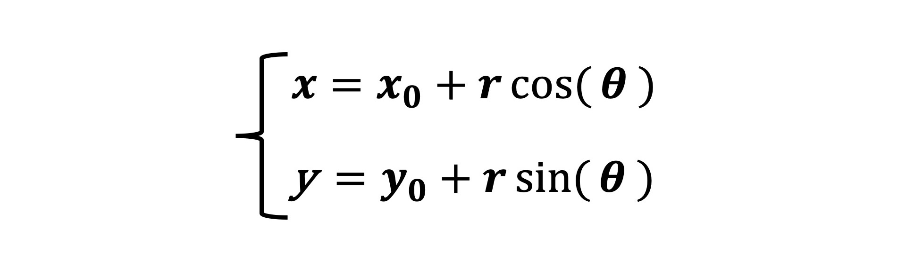
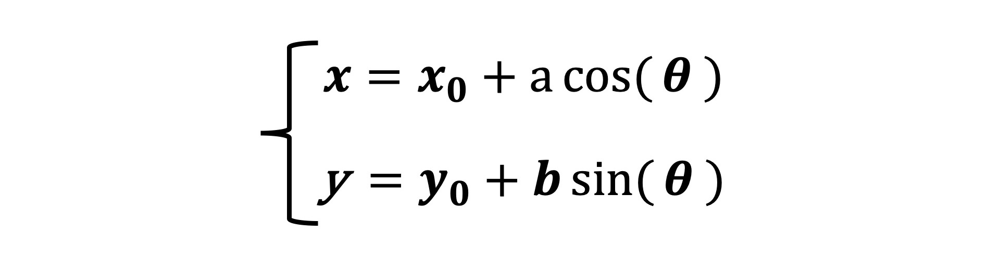
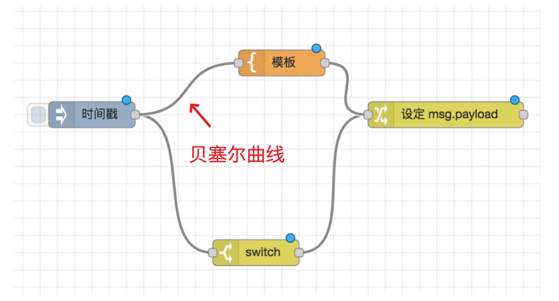
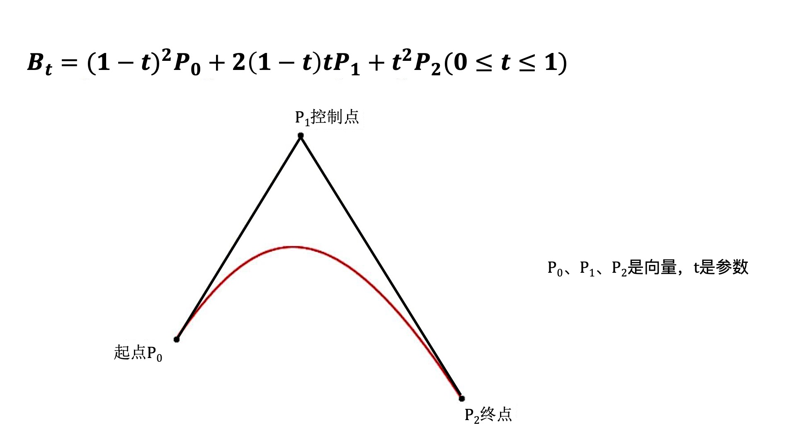
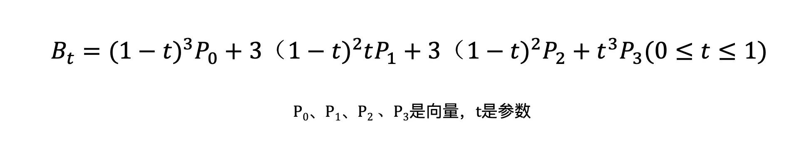

[TOC]

# **如何用向量和参数方程描述曲线**

曲线是图形系统的基本元素之一，它可以构成几何图形的边，也可以描述点和几何体的运动轨迹，还可以控制像素属性的变化。

不论我们用什么图形系统绘图，图形的呈现都离不开曲线。因此，对于可视化而言，掌握如何描述曲线是非常重要的。

## 如何用向量描述曲线？

## 如何用参数方程描述曲线？

接下来，我们就来讨论用参数方程描述曲线的方法。通过这个方法，我们不仅可以描述常见的圆、椭圆、抛物线、正余弦等曲线，还能描述更具有一般性的曲线，也就是没有被数学公式预设好的曲线，比如贝塞尔曲线，或者 Catmull–Rom 曲线等等。

**画圆**

圆可以用一组参数方程来定义。

如下所示的参数方程，定义了一个圆心在（x0,y0），半径为 r 的圆。



知道了方程，下面我们来说一下计算圆顶点的方法。首先，我们实现一个画圆弧的函数 arc，代码如下所示。我们设置圆心为 x0、y0，半径为 radius，起始角度为 startAng，结束角度是 endAng。

```js
const TAU_SEGMENTS = 60;
const TAU = Math.PI * 2;
function arc(x0, y0, radius, startAng = 0, endAng = Math.PI * 2) {
  const ang = Math.min(TAU, endAng - startAng);
  const ret = ang === TAU ? [] : [[x0, y0]];
  const segments = Math.round(TAU_SEGMENTS * ang / TAU);
  for(let i = 0; i <= segments; i++) {
    const x = x0 + radius * Math.cos(startAng + ang * i / segments);
    const y = y0 + radius * Math.sin(startAng + ang * i / segments);
    ret.push([x, y]);
  }
  return ret;
}

draw(arc(0, 0, 100));
```

**画圆锥曲线**

- 椭圆

  椭圆的参数方程。它其实和圆的参数方程很接近:

  

  其中，a、b 分别是椭圆的长轴和短轴，当 a = b = r 时，这个方程是就圆的方程式。所以，圆实际上就是椭圆的特例。

  函数代码: 

  ```js
  const TAU_SEGMENTS = 60;
  const TAU = Math.PI * 2;
  function ellipse(x0, y0, radiusX, radiusY, startAng = 0, endAng = Math.PI * 2) {
    const ang = Math.min(TAU, endAng - startAng);
    const ret = ang === TAU ? [] : [[x0, y0]];
    const segments = Math.round(TAU_SEGMENTS * ang / TAU);
    for(let i = 0; i <= segments; i++) {
      const x = x0 + radiusX * Math.cos(startAng + ang * i / segments);
      const y = y0 + radiusY * Math.sin(startAng + ang * i / segments);
      ret.push([x, y]);
    }
    return ret;
  }
  
  draw(ellipse(0, 0, 100, 50));
  ```

  

- 抛物线

  抛物线的参数方程。

  

  其中 p 是常数，为焦点到准线的距离。

  抛物线的参数方程是x轴线性方程，y轴二次方程，

  根据物理意义就可以知道，**水平方向匀速，垂直方向匀加速就是抛物线**

  函数代码:

  ```js
  const LINE_SEGMENTS = 60;
  function parabola(x0, y0, p, min, max) {
    const ret = [];
    for(let i = 0; i <= LINE_SEGMENTS; i++) {
      const s = i / 60;
      const t = min * (1 - s) + max * s;
      const x = x0 + 2 * p * t ** 2;
      const y = y0 + 2 * p * t;
      ret.push([x, y]);
    }
    return ret;
  }
  
  draw(parabola(0, 0, 5.5, -10, 10));
  ```

## **画其他常见曲线**

如果我们为每一种曲线都分别对应实现一个函数，就会非常笨拙和繁琐。

为了方便，我们可以用函数式的编程思想，封装一个更简单的 JavaScript 参数方程绘图模块，以此来绘制出不同的曲线。

这个绘图模块的使用过程主要分为三步。
第一步，我们实现一个叫做 parametric 的高阶函数，它的参数分别是 x、y 坐标和参数方程。

第二步，parametric 会返回一个函数，这个函数会接受几个参数，比如，start、end 这样表示参数方程中关键参数范围的参数，以及 seg 这样表示采样点个数的参数等等。后续其他参数是作为常数传给参数方程的数据。在下面的代码中，当 seg 默认 100 时，就表示在 start、end 范围内采样 101（seg+1）个点

第三步，我们调用 parametric 返回的函数之后，它会返回一个对象。这个对象有两个属性：一个是 points，也就是它生成的顶点数据；另一个是 draw 方法，我们可以利用这个 draw 方法完成绘图。

```js

// 根据点来绘制图形
function draw(points, context, {
  strokeStyle = 'black',
  fillStyle = null,
  close = false,
} = {}) {
  context.strokeStyle = strokeStyle;
  context.beginPath();
  context.moveTo(...points[0]);
  for(let i = 1; i < points.length; i++) {
    context.lineTo(...points[i]);
  }
  if(close) context.closePath();
  if(fillStyle) {
    context.fillStyle = fillStyle;
    context.fill();
  }
  context.stroke();
}

export function parametric(xFunc, yFunc) {
  return function (start, end, seg = 100, ...args) {
    const points = [];
    for(let i = 0; i <= seg; i++) {
      const p = i / seg;
        // 线性插值
      const t = start * (1 - p) + end * p;
        // const start -> end 插入值来顺滑
      const x = xFunc(t, ...args); // 计算参数方程组的x
      const y = yFunc(t, ...args);  // 计算参数方程组的y
      points.push([x, y]); // 带入并计算曲线方程的结果作为points的元素
    }
    return {
      draw: draw.bind(null, points),
      points,
    };
  };
}
```

重点代码: 包含**线性插值**以及**代入插值和参数得出计算结果作为pints的元素**

## **画贝塞尔曲线**

还有很多不规则的图形，无法用上面这些规律的曲线去描述。那我们该如何去描述这些不规则图形呢？

**贝塞尔曲线（Bezier Curves）**就是最常见的一种解决方式。它在可视化领域中也是一类非常常用的曲线，它通过**起点、终点和少量控制点**，就能定义参数方程来生成复杂的平滑曲线，所以它通常被用来构建数据信息之间连接线。



贝塞尔曲线又分为二阶贝塞尔曲线（Quadratic Bezier Curve）和三阶贝塞尔曲线（Qubic Bezier Curve）。

顾名思义，二阶贝塞尔曲线的参数方程是一元二次多项式，那么三阶贝塞尔曲线的参数方程是一元三次多项式

二阶贝塞尔曲线由三个点确定，P0是起点，**P1是控制点**，P2是终点，示意图如下：



代码如下: 

```js
const quadricBezier = parametric(
  (t, [{x: x0}, {x: x1}, {x: x2}]) => 
    (1 - t) ** 2 * x0 + 2 * t * (1 - t) * x1 + t ** 2 * x2,
  (t, [{y: y0}, {y: y1}, {y: y2}]) => 
    (1 - t) ** 2 * y0 + 2 * t * (1 - t) * y1 + t ** 2 * y2,
);

const p0 = new Vector2D(0, 0);
const p1 = new Vector2D(100, 0);
p1.rotate(0.75);
const p2 = new Vector2D(200, 0);
const count = 30;
for(let i = 0; i < count; i++) {
  // 绘制30条从圆心出发，旋转不同角度的二阶贝塞尔曲线
  p1.rotate(2 / count * Math.PI);
  p2.rotate(2 / count * Math.PI);
  quadricBezier(0, 1, 100, [
    p0,
    p1,
    p2,
  ]).draw(ctx);
}
```

三阶贝塞尔曲线的参数方程为：



与二阶贝塞尔曲线相比，三阶贝塞尔曲线有 4 个点，其中 P0和 P3是起点和终点，**P1、P2是控制点**，所以三阶贝塞尔曲线**有两个控制点**。


代码如下:

```js
const cubicBezier = parametric(
  (t, [{x: x0}, {x: x1}, {x: x2}, {x: x3}]) => 
    (1 - t) ** 3 * x0 
    + 3 * t * (1 - t) ** 2 * x1 
    + 3 * (1 - t) * t ** 2 * x2 
    + t ** 3 * x3,
  (t, [{y: y0}, {y: y1}, {y: y2}, {y: y3}]) => (1 - t) ** 3 * y0 + 3 * t * (1 - t) ** 2 * y1 + 3 * (1 - t) * t ** 2 * y2 + t ** 3 * y3,
);

const p0 = new Vector2D(0, 0);
const p1 = new Vector2D(100, 0);
p1.rotate(0.75);
const p2 = new Vector2D(150, 0);
p2.rotate(-0.75);
const p3 = new Vector2D(200, 0);
const count = 30;
for(let i = 0; i < count; i++) {
  p1.rotate(2 / count * Math.PI);
  p2.rotate(2 / count * Math.PI);
  p3.rotate(2 / count * Math.PI);
  cubicBezier(0, 1, 100, [
    p0,
    p1,
    p2,
    p3,
  ]).draw(ctx);
}
```

控制点越多，曲线能够模拟出更多不同的形状，也能更精确地控制细节。

贝塞尔曲线对于可视化，甚至整个计算机图形学都有着极其重要的意义。因为它能够**针对一组确定的点**，在其中**构造平滑的曲线**，这也让图形的实现有了更多的可能性。


实际上 Canvas2D [bezierCurveTo](https://developer.mozilla.org/zh-CN/docs/Web/API/CanvasRenderingContext2D/bezierCurveTo) 和 SVG [svg - path - Q = quadratic Bézier curve ](https://www.runoob.com/svg/svg-path.html)都提供了直接绘制贝塞尔曲线的 API，比如在 Canvas2D 中，我们可以通过创建 Path2D 对象，使用 Path2D 支持的 SVGPath 指令添加贝塞尔曲线。即使如此，我们依然需要掌握贝塞尔曲线的基本原理。因为在 WebGL 这样的图形系统里，我们还是需要自己实现贝塞尔曲线的绘制，而且贝塞尔曲线除了绘制曲线之外，还有其他的用处，比如构建平滑的轨迹动画、属性插值等等。

