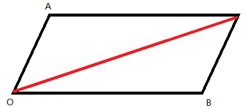
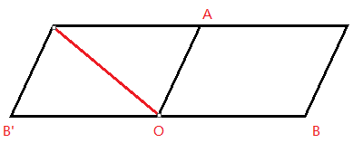
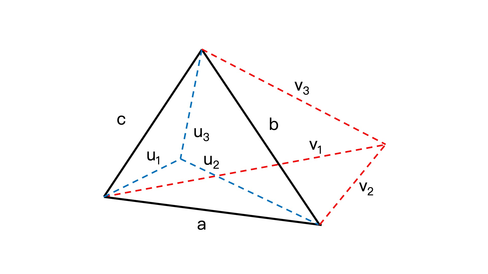
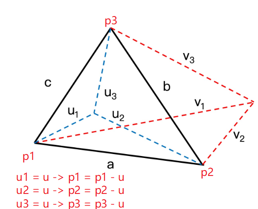
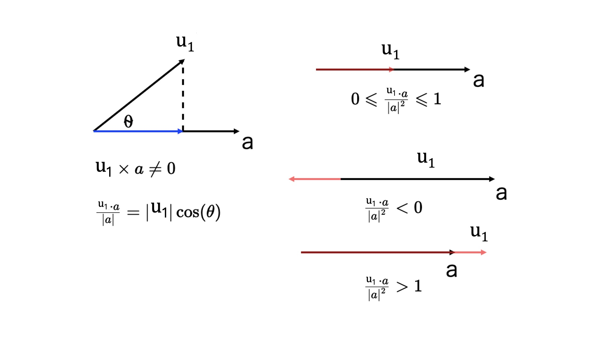

[toc]

## 实现通用的isPointInPath方法

不使用 Canvas 的 isPointInPath 方法，而是直接通过点与几何图形的数学关系来判断点是否在图形内。

但是，直接判断一个点是不是在一个几何图形内还是比较困难的，因为这个几何图形可能是简单多边形，也可能是复杂多边形。

完全可以把视线放在最简单的多边形，也就是三角形上。因为对于三角形来说，我们有一个非常简单的方法可以判断点是否在其中。

这个方法就是，已知一个三角形的三条边分别是向量 a、b、c，平面上一**点 u** 连接三角形三个顶点的向量分别为 u1、u2、u3，那么 u 点在三角形内部的充分必要条件是：**u1 X a、u2 X b、u3 X c 的符号相同 (叉乘)**。

**叉乘结果是一个向量，向量模长是向量A，B组成平行四边形的面积；向量方向是垂直于向量A,B组成的平面；**

补充向量加减法的几何意义:

向量加减法: 使用平行四边形来快速理解

1. 加法: 结果向量为平行四边形的对角边
2. 减法: 将被减向量方向方向相反后再与前一个向量相加, 还是对角边





减法公式: OA - OB = OA + (OB') = BA ( 被减指向减 )

三角形OAB中的 BA  = OA - OB, 可以得出三角形中, 两边(向量)相减得到另一边; 只要起点相同 (不限原点)

​	

回到证明公式上: 看下面的示意图，当点 u 在三角形 a、b、c 内时，因为 u1到 a、u2到 b、u3到 c 的**小角旋转方向是相同**的（这里都为顺时针），所以 u1 X a、u2 X b、u3 X c 要么同正，要么同负。当点 v 在三角形外时，v1到 a 方向是顺时针，v2到 b 方向是逆时针，v3到 c 方向又是顺时针，所以它们叉乘的结果符号并不相同。





根据这个原理，我们就可以写一个简单的判定函数了，代码如下：

```js
function inTriangle(p1, p2, p3, point) {
  const a = p2.copy().sub(p1);
  const b = p3.copy().sub(p2);
  const c = p1.copy().sub(p3);

  const u1 = point.copy().sub(p1); // 保持统一就不影响计算结果
  const u2 = point.copy().sub(p2);
  const u3 = point.copy().sub(p3);

  const s1 = Math.sign(a.cross(u1));
  const s2 = Math.sign(b.cross(u2));
  const s3 = Math.sign(c.cross(u3));

  return s1 === s2 && s2 === s3;
}
```

补充说明, 三角形两点相减得到对边向量,  另"三角形p1p2U" 中也同样有`a = u1 - u2 = p2 - p1`

补充判断 `点在线上的情况` 

如果一个点 u 在三角形的一条边 a 上，那就会需要满足以下 2 个条件：

1. a.cross(u1) === 0
2. 0 <= a.dot(u1) / a.length ** 2 <= 1 (点乘, 几何意义**投影**)

第一个条件很容易理解，我就不细说了，我们重点来看第二个条件。下面，我就分别讨论一下点 u 和 a 在一条直线上和不在一条直线上这两种情况。



当向量 u1与 a 不在一条直线上时，u1与 a 的叉乘结果不为 0，而 u1与 a 的点乘的值除以 a 的长度，相当于 u1在 a 上的投影。

当向量 u1与 a 在一条直线上时，u1与 a 的叉乘结果为 0，u1与 a 的点乘结果除以 a 的长度的平方，正好是 u1与 a 的比值。

u1与 a 的比值也有三种情况：

1. 当 u1在 a 上时，u1和 a 比值是介于 0 到 1 之间的；
2. 当 u1在 a 的左边时，这个比值是小于 0 的；
3. 当 u1 在 a 的右边时，这个比值是大于 1 的。

因此，只有当 u1 和 a 的比值在 0 到 1 之间时，才能说明点在三角形的边上。

补充点乘结果判断代码: 

```js
function inTriangle(p1, p2, p3, point) {
  const a = p2.copy().sub(p1);
  const b = p3.copy().sub(p2);
  const c = p1.copy().sub(p3);

  const u1 = point.copy().sub(p1);
  const u2 = point.copy().sub(p2);
  const u3 = point.copy().sub(p3);

  const s1 = Math.sign(a.cross(u1));
  let p = a.dot(u1) / a.length ** 2; // 判断点乘结果与边长平方的比值
  if(s1 === 0 && p >= 0 && p <= 1) return true;

  const s2 = Math.sign(b.cross(u2));
  p = b.dot(u2) / b.length ** 2;
  if(s2 === 0 && p >= 0 && p <= 1) return true;

  const s3 = Math.sign(c.cross(u3));
  p = c.dot(u3) / c.length ** 2;
  if(s3 === 0 && p >= 0 && p <= 1) return true;

  return s1 === s2 && s2 === s3;
}
```

注: 若是存在变换坐标轴的方法, 如 context.translate(), context.scale() 则需要调整相应的判断点, 具体算法是比较哪些顶点&那个比较的坐标点
