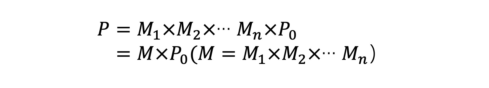
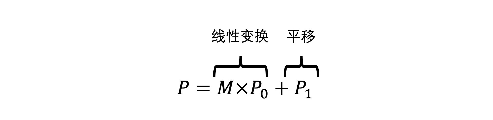
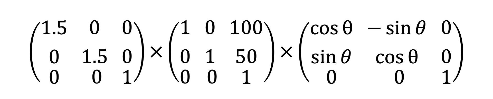

[TOC]

# 如何用仿射变换对几何图形进行坐标变换？

在画布上绘制许多轮廓相同的图形只需要创建一个基本的几何轮廓，然后通过仿射变换来改变几何图形的位置、形状、大小和角度。

仿射变换是<u>拓扑学和图形学</u>中一个非常重要的基础概念。利用它，我们才能在可视化应用中快速绘制出形态、位置、大小各异的众多几何图形。

## 什么是仿射变换？

**仿射变换简单来说就是“线性变换 + 平移**”。比如，对元素设置 CSS 的 transform 属性就是对元素应用仿射变换

再说回到几何图形，针对它的**仿射变换具有以下 2 个性质**：

- 仿射变换前是直线段的，仿射变换后依然是直线段
- 对两条直线段 a 和 b 应用同样的仿射变换，变换前后线段长度比例保持不变

由于仿射变换具有这两个性质，因此对线性空间中的几何图形进行仿射变换，就相当于**对它的每个顶点向量进行仿射变换**。

常见的仿射变换形式包括平移、旋转、缩放以及它们的组合。

**向量的平移、旋转与缩放**

**平移变换**是最简单的仿射变换。如果我们想让向量 P(x0, y0) 沿着向量 Q(x1, y1) 平移，只要将 P 和 Q 相加就可以了。

**旋转变换**, 在第 5 课接触过，当时我们把向量的旋转定义成了如下的函数：

```ts
class Vector2D {
  ...  
  rotate(rad) {
    const c = Math.cos(rad),
      s = Math.sin(rad);
    const [x, y] = this;

    this.x = x * c + y * -s;
    this.y = x * s + y * c;

    return this;
  }
}
```

通过三角函数来简单推导一下: 


假设向量 P 的长度为 r，角度是⍺，现在我们要将它逆时针旋转⍬角，此时新的向量 P’的参数方程为：


因为 rcos⍺、rsin⍺是向量 P 原始的坐标 x0、y0，所以，我们可以把坐标代入到上面的公式中，就会得到如下的公式：

将它写成矩阵形式，就会得到一个旋转矩阵。至于为什么要写成矩阵形式，我后面会讲，这里你先记住这个旋转矩阵的公式就可以了。

**缩放变换**, 可以直接让向量与标量（标量只有大小、没有方向）相乘:

对于得到的这个公式，我们也可以把它写成矩阵形式。结果如下：


得到了三个基本的仿射变换公式，其中旋转和缩放都可以写成矩阵与向量相乘的形式。

这种能写成**矩阵与向量相乘形式的变换，就叫做线性变换**。

线性变换除了可以满足仿射变换的 2 个性质之外，还有 2 个额外的性质：

- 线性变换**不改变坐标原点**（因为如果 x0、y0等于零，那么 x、y 肯定等于 0）；
- 线性变换**可以叠加**，多个线性变换的叠加结果就是将线性变换的**矩阵依次相乘**，**再与原始向量相乘**。

那根据线性变换的第 2 条性质，我们就能总结出一个通用的线性变换公式，即一个原始向量 P0经过 M1、M2、…Mn 次的线性变换之后得到最终的坐标 P。

**线性变化的叠加是一个非常重要的性质，它是我们对图形进行变换的基础**，所以你一定要牢记线性变化的叠加性质。

总的来说，向量的基本仿射变换分为平移、旋转与缩放，其中旋转与缩放属于线性变换，而平移不属于线性变换

基于此，我们可以得到仿射变换的一般表达式，如下图所示：

### **仿射变换的公式优化**

上面这个公式我们还可以改写成矩阵的形式，在改写的公式里，我们实际上是给线性空间增加了一个维度。

换句话说，我们用高维度的线性变换表示了低维度的仿射变换！

我们就将原本 n 维的坐标转换为了 n+1 维的坐标。

这种 n+1 维坐标被称为**齐次坐标**，对应的矩阵就被称为**齐次矩阵**。


齐次坐标和齐次矩阵是可视化中非常常用的数学工具，它能让我们**用线性变换来表示仿射变换**。

这样一来，我们就能利用线性变换的叠加性质，来非常方便地进行各种复杂的仿射变换了。

落实到共识上，就是把这些变换的矩阵相乘得到一个新的矩阵，再把它乘以原向量。我们在绘制几何图形的时候会经常用到它，所以你要记住这个公式。


## 仿射变换的应用：实现粒子动画

<!-- [demo](./demos/_09 如何用仿射变换对几何图形进行坐标变换？\仿射变换的应用：实现粒子动画.html) -->
<a href="./demos/_09 如何用仿射变换对几何图形进行坐标变换？\仿射变换的应用：实现粒子动画.html" target="_blank">demo</a>

这个粒子动画的运行效果，是从一个点开始发射出许多颜色、大小、角度各异的三角形，并且通过不断变化它们的位置，产生一种撒花般的视觉效果。

### 创建三角形

**创建三角形一共可以分为两步，第一步，我们定义三角形的顶点并将数据送到缓冲区。 **[复习一下第 4 节课](./#4 GPU与渲染管线：如何用WebGL绘制最简单的几何图形？.md)

```js
const position = new Float32Array([
  -1, -1,
  0, 1,
  1, -1,
]);
// 将定义好的数据写入 WebGL 的缓冲区
const bufferId = gl.createBuffer();
gl.bindBuffer(gl.ARRAY_BUFFER, bufferId);
gl.bufferData(gl.ARRAY_BUFFER, position, gl.STATIC_DRAW);

// 将缓冲区数据读取到 GPU
const vPosition = gl.getAttribLocation(program, 'position'); // 获取顶点着色器中的position变量的地址
gl.vertexAttribPointer(vPosition, 2, gl.FLOAT, false, 0, 0); // 给变量设置长度和类型
gl.enableVertexAttribArray(vPosition); // 激活变量
```

### 创建随机三角形属性的函数

利用 randomTriangles 随机创建一个三角形的<u>信息</u>，其中的参数包括颜色 u_color、初始旋转角度 u_rotation、初始大小 u_scale、初始时间 u_time、动画持续时间 u_diration、运动方向 u_dir 和创建时间 startTime。

除了 startTime 之外的数据，我们都需要传给 shader 去处理。

```js
function randomTriangles() {
  const u_color = [Math.random(), Math.random(), Math.random(), 1.0]; // 随机颜色
  const u_rotation = Math.random() * Math.PI; // 初始旋转角度
  const u_scale = Math.random() * 0.05 + 0.03; // 初始大小
  const u_time = 0;
  const u_duration = 3.0; // 持续3秒钟

  const rad = Math.random() * Math.PI * 2;
  const u_dir = [Math.cos(rad), Math.sin(rad)]; // 运动方向
  const startTime = performance.now();

  return {u_color, u_rotation, u_scale, u_time, u_duration, u_dir, startTime};
}
```

### 设置 uniform 变量

在 <u>WebGL 的 shader</u> 中，**顶点相关的变量可以用 attribute 声明**。

但是，我们现在要把 u_color、u_rotation 等一系列变量也传到 shader 中，这些变量**与**三角形**具体顶点无关**，它们是一些固定的值。

这时候，我们就要用到 <u>shader 的另一种变量声明</u>，也就是 **uniform** 来声明。

它们有什么区别: 

1. **attribute 变量是对应于顶点的**; 几何图形有**几个顶点就要提供几份 attribute 数据**。attribute 变量**只能在顶点着色器**中使用, 如果要在片元着色器中使用，需要我们通过 **varying 变量将它传给片元着色器**才行。这样一来，片元着色器中获取的实际值，就是**经过顶点线性插值**的。
2. **uniform 声明的变量和其他语言中的常量**一样; 赋给 unform 变量的值在 shader 执行的过程中不可改变。而且一个变量的值是唯一的，不随顶点变化。**uniform 变量既可以在顶点着色器中使用，也可以在片元着色器中使用。**

attribute / 属性 /   

uniform / 统一的; 一致的; 始终如一的 /

varying / 变化的 /

在 WebGL 中，我们可以通过 `gl.uniformXXX(loc, u_color);` 的方法**将数据传给 shader 的 uniform 变量**。其中，XXX 是我们随着数据类型不同取得不同的名字。我在下面列举了一些比较常用的：

- gl.uniform1f 传入一个浮点数，对应的 uniform 变量的类型为 float
- gl.uniform4f 传入四个浮点数，对应的 uniform 变量类型为 float[4]
- gl.uniform3fv 传入一个三维向量，对应的 uniform 变量类型为 vec3
- gl.uniformMatrix4fv 传入一个 4x4 的矩阵，对应的 uniform 变量类型为 mat4

将随机三角形信息传给 shader 里的 uniform 变量。代码如下：

```js
function setUniforms(gl, {u_color, u_rotation, u_scale, u_time, u_duration, u_dir}) {
  // gl.getUniformLocation 拿到uniform变量的指针
  let loc = gl.getUniformLocation(program, 'u_color');
  // 将数据传给 unfirom 变量的地址
  gl.uniform4fv(loc, u_color); // 四维向量

  loc = gl.getUniformLocation(program, 'u_rotation'); // 角度
  gl.uniform1f(loc, u_rotation);

  loc = gl.getUniformLocation(program, 'u_scale');
  gl.uniform1f(loc, u_scale);

  loc = gl.getUniformLocation(program, 'u_time');
  gl.uniform1f(loc, u_time);

  loc = gl.getUniformLocation(program, 'u_duration');
  gl.uniform1f(loc, u_duration);

  loc = gl.getUniformLocation(program, 'u_dir');
  gl.uniform2fv(loc, u_dir); // 二维向量
}
```


> 参考资料:
>
>  [webGL 教程](http://www.webgl3d.cn/WebGL/)
>
> [MDN 官方文档](https://developer.mozilla.org/en-US/docs/Web/API/WebGLRenderingContext/uniform)

着色器语言还提供了三个关键字`attribute`、`uniform`和`varying`用来声明特定用途的变量。

| 关键字(变量类型) | 数据传递               | 声明变量                   |
| :--------------- | :--------------------- | :------------------------- |
| attribute        | js=>顶点着色器         | 声明顶点数据变量           |
| uniform          | js=>顶点、片元着色器   | 声明非顶点数据变量         |
| varying          | 顶点着色器=>片元着色器 | 声明需要插值计算的顶点变量 |

**attribute 类型变量**

`attribute`关键字通常用来**声明与顶点数据相关的变量**, 顶点着色器中通过`attribute`关键字声明的顶点变量，javascript代码可以通过相关的WebGL API把顶点的数据传递给着色器中相应的顶点变量。

因为javascript没必要给<u>片元着色器传递顶点数据</u>，所以规定`attribute`关键字**只能在顶点着色器中声明变量**使用。

**`uniform`类型变量**

`uniform`关键字出现的目的就是为了**javascript可以通过相关的WebGL API给着色器变量传递数据**，比如传递一个光源的位置数据、一个光源的方向数据、一个光源的颜色数据、一个用于顶点变换的模型矩阵、一个用于顶点变换的视图矩阵... javascript可以给顶点着色器的变量传递数据，也可以给片元着色器的变量传递数据，也就是说**`uniform`关键字既可以在顶点着色器中使用，也可以在片元着色器中使用。**

不过要注意如果是顶点相关的变量，比如顶点位置、顶点颜色等顶点数据相关变量不能使用关键字`uniform`去声明，主要是顶点的数据往往不是一个，通常有很多个顶点，而且<u>这些顶点都要逐顶点执行`main`函数中的程序</u>, 为了声明顶点数据相关的变量，着色器语言规定了一个新的关键字`attribute`。

**`varying`类型变量**

`varying`类型变量主要是为了完成**顶点着色器和片元着色器之间的数据传递和插值计算**。比如在一个WebGL程序中通过三个顶点绘制一个彩色三角形，三个顶点的位置坐标定义了一个三角形区域，这个三角形区域经过片元着色器处理后会得到由一个个片元或者说像素组成的三角形区域，**在片元化的过程中，顶点的颜色数据也会进行插值计算，插值计算之前每个顶点对应一个颜色，插值计算之后，每个片元对应一个颜色值，通过`varying`关键字就可以在片元着色器中获得插值后的颜色数据，然后赋值给片元。**

在顶点着色器中声明了一个顶点颜色变量，如果想在片元着色器中获得顶点颜色**插值计算以后的数据**，需要同时在顶点着色器和片元着色器中执行`varying vec4 v_color;`，

也就是在顶点、片元**两个着色器代码中都需要通过关键字`varying`声明一个新相同变量`v_color`**,最后再顶点着色器中执行`v_color = a_color;`即可

```glsl
// VS
attribute vec4 a_color;// attribute声明顶点颜色变量
varying vec4 v_color;//varying声明顶点颜色插值后变量
void main() {
  //顶点颜色插值计算
  v_color = a_color;
}
```

```glsl
// FS
// 接收顶点着色器中v_color数据
varying vec4 v_color;
void main() {
  // 插值后颜色数据赋值给对应的片元
  gl_FragColor = v_color;
}
```

#### 内置变量

着色器语言中的内置变量`gl_PointSize`、`gl_Position`、`gl_FragColor`等等，声明一些变量使用的关键字`attribute`、`uniform`、`varying`。学习着色器语言的时候，如果你有兴趣可以深入研究GPU，对于WebGL学习来说，把GPU当成一个黑箱就可以，你只需要学会着色器语言的编程规则即可

普通变量，着色器语言和javascript语言一样需要先声明后使用，所谓内置变量就是不用声明可以直接赋值，主要是为了实现特定的功能。

| 内置变量      | 含义                               | 值数据类型 |
| :------------ | :--------------------------------- | :--------- |
| gl_PointSize  | 点渲染模式，方形点区域渲染像素大小 | float      |
| gl_Position   | 顶点位置坐标                       | vec4       |
| gl_FragColor  | 片元颜色值                         | vec4       |
| gl_FragCoord  | 片元坐标，单位像素                 | vec2       |
| gl_PointCoord | 点渲染模式对应点像素坐标           | vec2       |


### 用 requestAnimationFrame 实现动画

使用 requestAnimationFrame 实现动画。具体的方法就是，我们在 update 方法中每次新建数个随机三角形，然后依次修改所有三角形的 u_time 属性，通过 setUniforms 方法将修改的属性更新到 shader 变量中。这样，我们就可以在 shader 中读取变量的值进行处理了。代码如下：

```js
let triangles = [];

function update() {
  for(let i = 0; i < 5 * Math.random(); i++) {
    triangles.push(randomTriangles());
  }
  gl.clear(gl.COLOR_BUFFER_BIT);
  // 对每个三角形重新设置u_time
  triangles.forEach((triangle) => {
    triangle.u_time = (performance.now() - triangle.startTime) / 1000;
    setUniforms(gl, triangle);
    gl.drawArrays(gl.TRIANGLES, 0, position.length / 2);
  });
  // 移除已经结束动画的三角形
  triangles = triangles.filter((triangle) => {
    return triangle.u_time <= triangle.u_duration;
  });
  requestAnimationFrame(update);
}

requestAnimationFrame(update);
```

### 顶点着色器

用到前面讲过的仿射变换，在顶点着色器中进行矩阵运算。

顶点着色器中的 glsl 代码最关键，我们先来看一下这个代码是怎么写的。

```glsl

attribute vec2 position;

uniform float u_rotation;
uniform float u_time;
uniform float u_duration;
uniform float u_scale;
uniform vec2 u_dir; // u_dir 是个单位向量

varying float vP;

void main() {
  float p = min(1.0, u_time / u_duration); // p 是当前动画进度
  float rad = u_rotation + 3.14 * 10.0 * p; // rad 是旋转角度
  float scale = u_scale * p * (2.0 - p); // scale 是缩放比例, p * (2.0 - p) 是一个缓动函数
  vec2 offset = 2.0 * u_dir * p * p; // offset 是一个二维向量
  mat3 translateMatrix = mat3( // 偏移矩阵
    1.0, 0.0, 0.0,
    0.0, 1.0, 0.0,
    offset.x, offset.y, 1.0
  );
  mat3 rotateMatrix = mat3( // 旋转矩阵
    cos(rad), sin(rad), 0.0,
    -sin(rad), cos(rad), 0.0,
    0.0, 0.0, 1.0
  );
  mat3 scaleMatrix = mat3( // 缩放矩阵
    scale, 0.0, 0.0,
    0.0, scale, 0.0,
    0.0, 0.0, 1.0
  );
  gl_PointSize = 1.0;
  // 将 pos 的值设置为这三个矩阵与 position 的乘积，这样就完成对顶点的线性变换，呈现出来的效果也就是三角形会向着特定的方向旋转、移动和缩放。
  vec3 pos = translateMatrix * rotateMatrix * scaleMatrix * vec3(position, 1.0);
  gl_Position = vec4(pos, 1.0);
  vP = p; // 插值
}
```

### 片元着色器

在片元着色器中对这些三角形着色。我们将 p 也就是动画进度，从顶点着色器通过变量 varying vP 传给片元着色器，然后在片元着色器中让 alpha 值随着 vP 值变化，这样就能同时实现粒子的淡出效果了。

```glsl

 precision mediump float;
  uniform vec4 u_color;
  varying float vP;

  void main()
  {
    gl_FragColor.xyz = u_color.xyz;
    gl_FragColor.a = (1.0 - vP) * u_color.a; // 设置透明度
  }  
```


## CSS的仿射变换

CSS 中我们常用的属性 transform: `transform: rotate(30deg) translate(100px,50px) scale(1.5);`

CSS 中的 transform 是一个很强大的属性，它的作用其实也是对元素进行仿射变换。它不仅支持 translate、rotate、scale 等值，还支持 matrix。CSS 的 matrix 是一个简写的齐次矩阵，因为它省略了 3 阶齐次矩阵第三行的 0, 0, 1 值，所以它 只有 6 个值。

优化它来提高性能: 

结合上面介绍的齐次矩阵变换的原理，我们可以对 CSS 的 transform 属性进行压缩。

```css
div.block {
  transform: rotate(30deg) translate(100px,50px) scale(1.5);
}
```

实际上相当于我们做了如下变换：



简单算一下三个矩阵相乘, 最后用一个矩阵来表示结果: (不是很方便维护) 

```css
div.block { transform: matrix(1.3,0.75,-0.75,1.3,61.6,93.3)；}
```

## 要点总结

这一节课我们介绍了用向量和矩阵运算来改变几何图形的形状、大小和位置。其中，向量的平移、旋转和缩放都属于仿射变换，而**仿射变换**具有 2 个性质：

- 变换前是直线段的，变换后依然是<u>直线</u>段
- 对两条直线段 a 和 b 应用同样的仿射变换，变换前后线段长度<u>比例保持不变</u>

那仿射变换中的旋转和缩放又属于线性变换，而**线性变换**在仿射变换性质的基础上还有 2 个额外的性质:

- 线性变换不改变坐标原点（因为如果 x0、y0等于零，那么 x、y 肯定等于 0）
- 线性变换可以叠加，多个线性变换的叠加结果就是将线性变换的矩阵依次相乘，再与向量相乘

通过齐次坐标和齐次矩阵，我们可以将平移这样的非线性仿射变换**用更高维度的线性变换**来表示。这么做的目的是让我们能够将仿射变换的组合**简化为矩阵乘法**运算。


